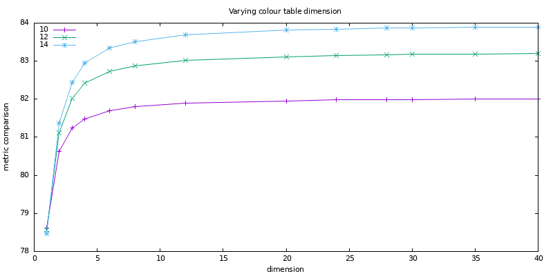
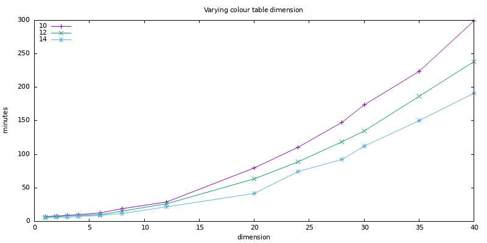

# PhotoMosaic
PhotoMosaic Poster Generator. 

A photo mosaic is a large image composed of many smaller images.
The aim is to be able to view the large picture from a distance
while still being able to discern the smaller images when viewed
up close.  

This Python code generates a large poster sized picture of an input
image using small thumbnails generated from your own photo archive.
For best results, a large photo archive is needed, for example 10,000
or more images, although it can used used when there are fewer 
images available. The mosaic is generated for standard page sizes,
for example A1, A0, B1 or B0 as well as custom sizes, and the size 
of the small images comprising the mosaic can be specified,
for example as 10mm or 12mm squares. The intention is to produce
a mosaic poster to be printed and displayed.  

## Overview

The process requires four steps:

* Install **python** then the [pillow](https://pypi.org/project/pillow/)
and [imagehash](https://pypi.org/project/ImageHash/) packages.  
This has been tested on Windows and Ubuntu Linux using
[Anaconda](https://www.anaconda.com/) by creating a new
Python environment as follows:  
``conda create -n mosaic``  
``conda activate mosaic``  
``conda install pillow``  
``conda install imagehash``  

* `prepare.py`  
Creates a collection of square thumbnail images from a photo archive containing
gif, jpg or png files. This process ensures the images are oriented correctly
and removes duplicates using `md5sum` and near duplicates using the Python
`imagehash` package. These thumbnails are referred to as image *tiles* and
are used to create the photomosaic. The near duplicates are removed since my
own photo archive contains many similar photos that detract from the photo
mosaic result. The near duplicates are copied to a new directory so they can be 
reviewed to check they are indeed near duplicates. This can be useful for
adjusting the _hash threshold_ parameter used for this step (see below).

* `catalog.py`  
Create a colour summary of the tiles generated by the previous step.
The colour summary is the average red/green/blue (RGB) values for
the image tiles, which may be split into _d_ x _d_ dimensions along each axis,
producing better mosaic results.

* `mosaic.py`  
Create a mosaic of an input image by placing tiles that closely colour match
the pixels of the input image. This colour matching is done using the colour
summary created in the previous step.  

## Examples

As an example, the 
[baboon](https://raw.githubusercontent.com/scijs/baboon-image/master/baboon.png)
image on the left below was mosaicked using 30,000 synthetic small tiles of
uniform colour generated randomly by a Python program. While this is a contrived 
example it demonstrates how the mosaicking process works. Each synthetic tile 
includes a white border of a single pixel width to highlight where the tiles 
are located in the mosaic. Both mosaics below have been generated allowing the 
same tile to be reused throughout the mosaic.  

Original image             |  Mosaic image with duplicate tiles allowed  | Mosaic image with duplicates and tile 'blending' of 20%
:-------------------------:|:-------------------------------------------:|:-------------------------------------------------------:
  |    |   

The mosaic on the right also merges or _blends_ the original image by a factor
of 20%. This blending option gives a better representation of the original image 
but it is not a _true_ mosaic. This option is provided when there are not many 
images in the archive to produce the mosaic. In this example, the detail of the 
baboon whiskers can be seen in the blended mosaic compared to the middle one. 
Allowing duplicate tiles usually results in a mosaic where the same tiles appear
many times in close proximity and is not generally recommended. In these examples 
where synthetic tiles are used it doesn't matter.  

The mosaics below do not allow duplicates and use a tile size of 8mm, 10mm and 12mm 
respectively from left to right. The other options used, explained further below, 
are a page size of A0 and no tile _blending_. The impact of using different tile 
sizes can be seen below - the smaller the tile size used, the better the mosaic 
resolution since more tiles are used in the image. Compare the detail of the nose 
and eyes for the baboon on the right below with that of the one on the left - 
the smaller tile size results in finer detail in the result. However, when printing 
the mosaic the images in the tiles are harder to discern for smaller images. It is 
recommended a tile size of 10mm or 12mm be used, but this is a personal preference. 
For the images below, there are 11,025 tiles used for the mosaic with a tile size 
of 8mm, 7,056 tiles for the mosaic with a tile size of 10mm and 4,900 tiles for the
mosaic with a tile size of 12mm. Note that the two mosaics above use a tile size 
of 10mm and all of these mosaics were generated with a paper size of A0 then cropped
to be square images.

No duplicate tiles and tiles size 8mm        |  No duplicate tiles, tile size 10mm    | No duplicate tiles, tile size 12mm
:-------------------------------------------:|:-------------------------------------:|:-------------------------------------------------------:
          |    |   

The tile placement algorithm starts in the middle of the image and spirals outwards 
so that the best matching tiles are placed centrally. The impact of this algorithm 
can be seen when comparing the first two mosaics where duplicates are allowed with 
the three above where duplicates are not allowed: the tile matching gets progressively
worse towards the edge of the image when duplicates are not allowed. This is because 
the best matching tiles have been used in the centre of the image and there are
progressively fewer tiles to choose from to place in the mosaic the further away 
from the centre of the image.

These five mosaics were generated using the `Anaconda PowerShell Prompt` as follows:  

``curl https://raw.githubusercontent.com/scijs/baboon-image/master/baboon.png -OutFile baboon.png``  
``conda activate mosaic``  
``python tiles.py``  
``python catalog.py synthetic_tiles synthetic_tiles.cat 1``  
``python mosaic.py baboon.png 10 mosaic1.png A0 synthetic_tiles.cat 1 True 0 0``  
``python mosaic.py baboon.png 10 mosaic2.jpg A0 synthetic_tiles.cat 1 True 0 20``  
``python mosaic.py baboon.png  8 mosaic3.png A0 synthetic_tiles.cat 1 False 0 0``  
``python mosaic.py baboon.png 10 mosaic4.png A0 synthetic_tiles.cat 1 False 0 0``  
``python mosaic.py baboon.png 12 mosaic5.png A0 synthetic_tiles.cat 1 False 0 0``  

Note the `prepare.py` step is not needed above since the tiles are
generated using `tiles.py` in a format ready for the `catalog.py` process.
The mosaics are generated in `png` format except for the blended one which is `jpg`.
These choices produce the smallest file sizes: it seems in these examples `png` 
uses better compression when only synthetic tiles are used whereas `jpg` is 
better when the original image is combined using image blending.  

## General Instructions

The following examples create a mosaic of the image 'C:\mosaic\example.png' using
a collection of images found in the 'C:\images' and 'C:\pictures' directories.
Note that full file and directory paths are recommended:  

* `python prepare.py C:\mosaic\tiles 5 png C:\images C:\pictures`

    * `C:\mosaic\tiles`  
      The directory that will contain the square image files used for mosaicking.  

    * `5`  
      The hash threshold value used to identify near duplicates.  

    * `png`  
      The image file format to use when generating tiles.Values can be `png` or `jpg`.  

    * `C:\images`  
      `C:\pictures`  
      The directories containing the images used for mosaicking. One or more directories
      must be specified. Copies of the near duplicates are placed into a new directory
      called, in this example, C:\mosaic\tiles_similar.  

* `python catalog.py C:\mosaic\tiles C:\mosaic\tiles3.cat 3`
    * `C:\mosaic\tiles`  
      The directory containing the image tiles created in the previous step.  

    * `C:\mosaic\tiles3.cat`  
      The catalogue file containing the colour summary of the square tiles. It is recommended that
      the dimension is included in the filename - multiple catalogue files can be created of
      differing dimensions to compare the mosaicking result.  

    * `3`  
      The dimension used to split each axis for the RGB colour summary.  

* `python mosaic.py C:\mosaic\example.png 10 C:\mosaic\mosaic.png A0 C:\mosaic\tiles3.cat 3 False 25 0`

    * `C:\mosaic\example.png`  
      The input image to be mosaicked.  

    * `10`  
      The size in millimetres of each tile used for mosaicking in the poster created.  

    * `C:\mosaic\mosaic.png`  
      The output mosaic image.  

    * `A0`  
      The size of the mosaic to be generated. Can be one of the standard sizes: A1, A0, B1 or B0.
      Can also specify a custom size by noting the required width and height as, for example, 
      `420x594` which is equivalent to an A2 page size. The width must always be less than or 
      equal to the height. To use this pagesize in the example above, the command would be:  

      `python mosaic.py C:\mosaic\example.png 10 C:\mosaic\mosaic.png 420x594 C:\mosaic\tiles3.cat 3 False 25 0`  

    * `C:\mosaic\tiles3.cat`  
      The RGB tile colour summary generated in the previous step.  

    * `3`  
      The dimension used to split each axis for the RGB colour summary in the previous step.  

    * `False`  
      Indicates if duplicate images can be used when generating the mosaic.  

    * `25`  
      The size in millimetres of the border around the generated mosaic. A border is recommended
      to provide room in the printed poster for the frame. If no frame is used this value can be 0.  

    * `0`  
      The percentage of 'blending' to use of the original image when generating the mosaic.
      I prefer no blending is used but setting as a small percentage improves the result when
      there are not many image tiles to work with.  

## Notes

* The `mosaic.py` program includes the constant `MOSAIC_DEBUG` that controls the amount of
  progress information displayed while running. This is currently set to `False`. If there
  are issues with the process, set this to `True` to see detailed information that may
  help identify the problem.

* The image format of the mosaic generated is determined by the file name extension used
  for the output file. Only `png` and `jpg` are recognised.  

* When the generated mosaic includes a border, a short text summary of the mosaicking process
  is included in the margin. If the baboon images above included a border, an example would be:  

  _Mosaic consists of 4,900 tiles (width 70 and height 70) from archive of 30,000 photos. Colour table dimension 1. Tile size 12mm. Duplicate tiles not allowed. Tile blending not used. Resolution 300 dpi. Generated on 2025-07-17._  

  The system default font is used for this text unless a new font is indicated by setting
  the following environment variable, for example:  

    `MOSAIC_FONT = C:\Windows\Fonts\arial.ttf`  

  Setting this environment variable is recommended when a poster border is used.

* This text in the margin can be avoided by setting the constant `INCLUDE_BANNER` to `False`
  in `mosaic.py`.

* A copy of the image used to create the mosaic is placed as a tile in the bottom left of the
  mosaic. This is used as a reminder of the image that was used to produce the mosaic.
  Note that this image is cropped to be a square tile, so is not the 'full' image used in the
  mosaicking process.

* After the mosaic has been created, the `mosaic.py` program compares the generated mosaic
  with the original image pixel by pixel to determine how 'close' they are. The 'distances'
  are calculated as the Euclidean distance of the two RGB pixel values being compared and
  the average is taken for the entire image. This value is then normalised and expressed
  as a percentage. This metric is useful for comparing the results of using different
  tile sizes for `mosaic.py` and different dimension values for the colour catalogue in
  `catalog.py`. As an example, the following results are from generating an A0 mosaic
  of [The Parrot House](https://www.ngv.vic.gov.au/explore/collection/work/2824/)
  from my personal collection of 11,474 images.  

  

  These results show that a dimension of 1 produces inferior mosaic images compared to using
  dimensions of 2 or more. The results for 8 or 12 dimensions seems optimal.  

  These results also indicate that using larger tile sizes produces better results but this
  is misleading. The first step in the metric calculation is to resize the smaller input
  image being mosaicked to be the same size as the mosaic image which is much larger.
  This is necessary to be able to compare the images pixel by pixel.
  For example, the image of the parrots used for the results above has width and height 
  dimensions of (1290,1591), while the mosaic with a tile size of 10mm has width and
  height of (9936,14044) and the mosaics using a tile size 12mm and 14mm are similar.
  When resizing the input image to this much larger size, the image becomes 'blocky'
  due to repeating coloured pixels. Using a smaller tile size results in more tiles 
  in the mosaic which have more pixel variation and so are less likely to match pixel
  by pixel.  

  For example, the three baboon mosaics shown above in the second triplet, where duplicate
  tiles are not used and the tile sizes vary from 8, 10 and 12 millimetres, have metric
  results of 86.18%, 87.11% and 87.57% respectively which indicates that the mosaic using 12mm
  tiles is best, but this is clearly not the case visually.

  The best way to determining a preferred tile size is to generate multiple
  mosaics with differing tile sizes and compare them on a large monitor/screen from a
  distance. The main result inferred from the graph above it that a dimension of 8 or
  12 produces near optimal results, but this may be related to the collection of images
  used to produce the mosaics and the choice of input image. Your mileage may vary and 
  you should generate multiple images using different dimensions and compare the 
  metric results.

* Be aware that using large dimensions for the catalogue increases the time taken to produce
  mosaics. The elapsed time for the results shown above can be seen in the plot below:

  

## License

This project is licensed under the MIT License - see [License](https://opensource.org/licenses/MIT)
or the License.txt file.  
